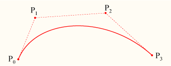

# ASS字幕文件说明

*这是我多年前所做的笔记，资料都是从网上摘抄，其中内容难免有缺失或错误。*

## 第一部分 [Script Info]

*这一部分主要是记录了一些文件内容的标题和信息*

``` yaml
[Script Info]
; Script generated by Aegisub r8942
; http://www.aegisub.org/
!: 注释
Title: Default Aegisub file
ScriptType: v4.00+
WrapStyle: 0
ScaledBorderAndShadow: yes
YCbCr Matrix: TV.601
Original Script: 脚本原作者
Original Translation: 译者
Original Editing: 编辑
Original Timing: 时间轴
Synch Point: 0
Script Updated By: 修订者
Update Details: 修订详情，修订部分的描述
PlayResX: 1280
PlayResY: 720
PlayDepth: 颜色深度
Collsions: Normal
Timer: 100.0000
```

下面就`[Script Info]`这一部分作简单说明：

* ASS文件第一行必须是`[Script Info]`

* `;`后面可以填写任何内容

* `!:`后面是注释部分

* `Title:`脚本文件的标题

* `ScriptType:`脚本格式`ASS`文件为`v4.00+`

* `WrapStyle:`指定了当一行字幕过长时的**换行方式**

  共有4种换行方式：

  `0`:智能换行：上行较宽

  `1`:于行尾词出换行：仅于`\N`后断行

  `2`:不自动换行：于`\n`和`\N`后断行

  `3`：智能换行：下行较宽

* `ScaledBorderAndShadow:`字幕边框宽度和阴影深度是否随着视频分辨率等比缩放，`yes`或`no`

* `YCbCr Matrix:`

* `Original Script:` 脚本原作者

* `Original Translation:` 译者

* `Original Editing:` 编辑

* `Original Timing:` 时间轴人员

* `Synch Point:` 同步点

* `Script Updated By:` 脚本修订者

* `Update Details:` 修订详情，修订部分的描述

* `PlayResX:` 视频宽度`PlayResY:` 视频高度，这两个定义了视频的分辨率

* `PlayDepth:` 显示颜色深度

* `Collsions:` 字幕碰撞处理，当两条字幕重叠时，如何进行移动，共有两种方式

  `Normal`：后一条字幕出现在前一条的上方

  `Reverse`：前一条字幕向上移动给后一条字幕让位

* `Timer:` 时间轴计时器，单位为`%`，默认为`100.0000`

  大于`100`时，字幕会比预定越来越早的出现

  小于`100`时，字幕会比预定越来越晚的出现

  一般不改变，取默认`100.0000`

## 第二部分 [V4+ Styles]

*这一部分主要保存了字幕的样式*

``` yaml
[V4+ Styles]
Format: Name, Fontname, Fontsize, PrimaryColour, SecondaryColour, OutlineColour, BackColour, Bold, Italic, Underline, StrikeOut, ScaleX, ScaleY, Spacing, Angle, BorderStyle, Outline, Shadow, Alignment, MarginL, MarginR, MarginV, Encoding
Style: Default,Arial,20,&H00FFFFFF,&H000000FF,&H00000000,&H00000000,0,0,0,0,100,100,0,0,1,2,2,2,10,10,10,1
```

以`[V4+ Styles]`作为这一部分的开始，紧跟着第二行`Format:`基本也是固定的，而`Style`行的各个**值**和`Format`行的各个**名字**之间是一一对应关系。这个部分就像是一张表单，`Format`行就是表头，`Style`行就是往表格里填的数据，大概就是这么一个关系，一个脚本可以设置多个字幕样式。

下面讲一下每个名字的具体意义：

* `Name`：样式名字
* `FontName`：字体名称
* `Fontsize`：字体大小
* `PrimaryColour`：主要填充颜色
* `SecondaryColour`：次要填充颜色，用于标准卡拉OK模式下的预填充
* `OutlineColour`：字体边框颜色
* `BackColour`：字体阴影色
* `Bold`：粗体，**1开启，0关闭**
* `Italic`：斜体，**1开启，0关闭**
* `Underline`：下划线，**1开启，0关闭**
* `StrikeOut`：删除线，**1开启，0关闭**
* `ScaleX`：宽度缩放，单位为`%`，默认`100`
* `ScaleY`：高度缩放，单位为`%`，默认`100`
* `Spacing`：字体间距
* `Angle`：旋转角度
* `BorderStyle`：边框样式；默认为`1`，即使用正常字体边框，设置为`3`时，则使用不透明背景取代字体边框
* `Outline`：边框宽度
* `Shadow`：阴影距离
* `Alignment`：字幕对齐方式
* `MarginL`：左边距
* `MarginR`：右边距
* `MarginV`：垂直边距
* `Encoding`：字体编码；默认为`1`

## 第三部分 [Events]

*这一部分就是字幕的主体部分，记录了对话的开始和结束时间，对话内容和显示等信息*

``` yaml
[Events]
Format: Layer, Start, End, Style, Name, MarginL, MarginR, MarginV, Effect, Text
Dialogue: 0,0:00:01.24,0:00:01.99,Default,,0,0,0,,所以
Comment: 0,0:00:00.00,0:00:00.00,Default,,0,0,0,,注释
```

这一部分以`Events`作为开始，后面紧跟的`Format`基本也是固定的，后面的行和`Format`也是对应关系。

* `Layer`：字幕的**层**，当两条字幕重叠时，层数较大的会叠加在层数小的上面，如果层数相同，那么后出现的会叠加的先出现的上面，层数默认为`0`
* `Start`：字幕的开始时间，精度为`0.01s`
* `End`：字幕的结束时间，精度为`0.01s`
* `Style`：样式名称，对应`[V4+ Styles]`中的`Name`项
* `Name`：说话人。只做参考，一般省略
* `MarginL`：左边距。可对样式进行修改，默认为`0`采用原值，若不为`0`则取代原值
* `MarginR`：右边距。可对样式进行修改，默认为`0`采用原值，若不为`0`则取代原值
* `MarginV`：垂直边距。可对样式进行修改，默认为`0`采用原值，若不为`0`则取代原值
* `Effect`：动态效果；`Scroll up, Scroll down, Banner, Karaoke`
* `Text`：字幕。可以通过添加代码改变字幕，实现多种特效

每一行字幕开头的修饰语有两种：

* `Dialogue`：正常的对话字幕内容
* `Comment`：注释内容，这些行不会作为字幕内容显示在视频中

## 第四部分 代码及其作用

在这一部分正式开始之前，先作一个简单的说明：

* 所有代码前必须加`\`
* 代码必须放在`{}`中，`\N`，`\n`，`\h`除外

在代码说明部分会出现以下标记：

* `<...>`：表示该部分需要输入参数
* `[...]`：表示该部分为可选择输入项
* `<../..>`：表示从给定参数中任选一项

---

### 常用代码

* `\N`：强制换行

* `\n`：空格，和空格键效果一样

* `\h`：强制空格，即使在行首和行尾也能生效

* `\a<alignment>`：设置字幕对齐方式，`alignment`取值如下表

  |      |  左  |  中  |  右  |
  | :--: | :--: | :--: | :--: |
  |  上  |  5   |  6   |  7   |
  |  中  |  9   |  10  |  11  |
  |  下  |  1   |  2   |  3   |

* `\an<alignment>`：设置字幕对齐方式，`alignment`取值和数字小键盘的布局相同，这种方式比较容易记住，所以通常采用这种方式设置对齐方式，包括第二部分`[V4+ Styles]`中的`Alignment`也是采用的这种对齐方式

  |      |  左  |  中  |  右  |
  | :--: | :--: | :--: | :--: |
  |  上  |  7   |  8   |  9   |
  |  中  |  4   |  5   |  6   |
  |  下  |  1   |  2   |  3   |

* `\b<0/1>`：设置粗体。`0`为关闭，`1`为开启

* `\b<weight>`：设置字体磅值，取值为100的倍数。`100: Lowest, 400: Normal, 700: Bold, 900: Heaviest`

* `\i<0/1>`：设置斜体。`0`为关闭，`1`为开启

* `\u<0/1>`：设置下划线。`0`为关闭，`1`为开启

* `\s<0/1>`：设置删除线。`0`为关闭，`1`为开启

* `\be<0/1>`：边框模糊。`0`为关闭，`1`为开启

* `\be<strength>`：边框模糊

* `\blur<strength>`：边缘模糊（高斯函数）。`strength`取值越大，效果越明显，当字幕没有边框时，显示为字幕主体模糊效果

* `\bord<size>`：设置边框宽度

* `\xbord<size>`：设置x方向边框宽度

* `\ybord<size>`：设置y方向边框宽度

* `\shad<depth>`：设置阴影距离

* `\xshad<depth>`：设置x方向阴影距离

* `\yshad<depth>`：设置y方向阴影距离

* `\r<style>`：设置样式

* `\r`：设置为默认样式

* `\fa<x/y><factor>`：文本错切。错切是在旋转之后应用的，以旋转后的坐标系为基准，不受旋转中心的影响，通常取值为`[-2, 2]`，超出范围取值效果并不好

* `\fn<fontname>`：设置字体，若要使字体旋转90°显示，在`fontname`前加`@`

* `\fs<fontsize>`：设置字体大小

* `\fe<charset>`：设置字体编码

* `\fsc<x/y><percent>`：设置字体缩放，`{\fscx<percent>}`代表宽度缩放，`{\fscy<percent>}`代表高度缩放，`percent`单位为`%`，默认为`100`

* `\fsp<pixels>`：设置字体间距，默认为`0`

* `\fr[<x/y/z>]<degrees>`：设置旋转角度，`x, y, z`分别代表横纵坐标轴和垂直于屏幕向上的坐标轴，`degrees`取值为正数逆时针旋转，取值为负数顺时针旋转，`\fr`是`\frz`的简写

* `\org(<x>, <y>)`：设置旋转中心点

* `\alpha&H<aa>&`：设置字体透明度，16进制，取值范围`00-FF`，取值越大，透明度越大

* `\$a&H<aa>&`：设置字体透明度，`$`可以取值为`1, 2, 3, 4`，分别代表*主要填充透明度，次要填充透明度，边框透明度，阴影透明度*

* `\c&H<bb><gg><rr>&`：设置字体颜色，16进制，`ASS`脚本中颜色格式为`<bbggrr>`

* `\$c&H<bb><gg><rr>&`：设置字体主体颜色，`$`可以取值为`1, 2, 3, 4`，分别代表*主要填充颜色，次要填充颜色，边框颜色，阴影颜色*

* `\move(<x1>, <y1>, <x2>, <y2>, [<t1>, <t2>])`：字幕移动效果

  `(x1, y1)`为开始位置，`(x2, y2)`为结束位置，`t1, t2`为移动的开始和结束时刻，单位为`ms`，相对于字幕的开始时间，若省略，则默认使用字幕的开始和结束时间

* `\pos(<x>, <y>)`：设置字幕位置

* `\fad(<t1>, <t2>)`：淡入淡出效果，`t1`为淡入所用时长，`t2`为淡出所用时长，单位为`ms`

* `\fade(<a1>, <a2>, <a3>, <t1>, <t2>, <t3>, <t4>)`：淡入淡出效果

  `a1`为淡入开始时的透明度，`a2`为淡入结束时的透明度，`a3`为淡出结束时的透明度，透明度采用10进制，取值为`0-255`

  `t1, t2`为淡入的起止时刻，`t3, t4`为淡出的起止时刻

* `\t([<t1>, <t2>, <accel>,] <style modifiers>)`：动态效果，可配合多种效果使用

  `t1, t2`为动态效果的开始和结束时刻，单位为`ms`，相对于字幕的开始和结束时间，若省略，则默认使用字幕的开始和结束时间

  `accel`用于控制动态效果的速度，默认为`1`，`0<accel<1`时，速度逐渐变慢，`accel>1`时，速度逐渐变快

* `\q<x>`：设置换行方式，取`0/1/2/3`

* `\clip([<x1>, <y1>,] <x2>, <y2>)`：字幕矩形遮罩，显示剪裁后的区域

* `\iclip([<x1>, <y1>,] <x2>, <y2>)`：字幕矩形遮罩，不显示剪裁后的区域

* `\clip([<scale>, ]<drawing commands>)`：遮罩（矢量绘图）

  `{\clip(1, m 50 0 b 100 0 100 100 50 100 b 0 100 0 0 50 0)}`将只显示椭圆内的字幕

* `\iclip([<scale>, ]<drawing commands>)`：遮罩（矢量绘图）

* `\p<0/1/..>`：绘图模式，`n`为放大比例，`{\p1}`启用绘图模式，`{\p0}`退出绘图模式

* `\pbo<y>`：设置绘制时的基线偏移，偏移发生在y方向，`y`小于`0`向上偏移，`y`大于`0`向下偏移

### Effect

* `Scroll up;<y1>;<y2>;<delay>[;<range>]`：字幕从下往上滚动

* `Scroll down;<y1>;<y2>;<delay>[;<range>]`：字幕从上往下滚动

  `y1`为字幕滚动开始时的竖直位置，`y2`为字幕滚动结束时的竖直坐标

  `delay`为字幕移动速度，单位为`ms/pixel`

  `range`为淡入淡出的范围

* `Banner;<delay>[;<0/1>, <range>]`：字幕横向滚动

  `delay`为字幕移动速度，单位为`ms/pixel`

  第二个参数取`0`时字幕从右向左移动，取`1`时字幕从左向右移动

  `range`为淡入淡出的范围

* `Karaoke`：卡拉OK效果

  `\k[<f/o>]<duration>`：`duration`为持续时间，单位为`0.01s`

  * `{\k<duration>}`：未填充时显示次要颜色，填充后显示主体颜色
  * `{\kf<duration>} and {\K<duration>}`：未填充时显示次要颜色，填充后显示主体颜色，填充过程有平滑效果
  * `{\ko<duration>}`：未填充时显示次要颜色，且不显示边框，填充后显示主体颜色和边框

---

### 绘图命令

* `m <x> <y>`：移动光标到点`(x, y)`，自动闭合之前的形状，开始新的绘制

* `n <x> <y>`：移动光标到点`(x, y)`，不闭合当前形状

* `l <x> <y>`：从当前光标位置绘制一条到点`(x, y)`的直线

* `b <x1> <y1> <x2> <y2> <x3> <y3>`：绘制一条从当前光标位置到点`(x3, y3)`的3次贝塞尔曲线，以`(x1, y1), (x2, y2)`为控制点

  

* `s <x1> <y1> <x2> <y2> <x3> <y3> .. <xN> <yN>`：`Cubic b-spline`绘制一条从当前光标位置开始的连续3次贝塞尔曲线，到达点N，至少应该包含3个点。相当于把多个贝塞尔曲线连接到一起。

* `p <x> <y>`：将b曲线延申至点`(x, y)`，相当于在`s`语句后面再加一个点

* `c`：闭合b曲线

---

### VSFilterMod可用效果

*这里只介绍相关代码，不讲如何使用`VSFilterMod`*

* `\fsc<scale>`：字体缩放，相当于同时使用`\fscx`和`\fscy`

* `\fsvp<leading>`：设置纵向偏移，`leading`取正数向上偏移，负数向下偏移

  `{\r\fsvp10}\fsvp10{\r\frz10}\frz10{\r\fsvp0}\fsvp0{\r\fsvp-10}\fsvp-10`

* `\frs<angle>`：文字基线倾斜，选择方向取决于样式设定的对齐方式。

  `{\frs90\frz-90}\frs90\frz-90`

* `\z<arg>`：设置`z`方向坐标，表示文字到屏幕的距离，结合`\frx`和`\fry`使用效果更明显

  `{\z100\t(\z0\frx360)}a`

* `\distort(<u1>, <v1>, <u2>, <v2>, <u3>, <v3>)`：文字扭曲效果，通过移动角上的坐标，具体确定相对的位置

  `{\distort(1, 0, 1.2, 1, -0.2, 0)}\distort(1, 0, 1.2, 1, -0.2, 0)`

* `\rnd[<x/y/z>]<arg>`：边界变形效果，在给定区间`(-arg, arg)`内随机移动边界上的像素

  `{\r\rnd10}\rnd10{\r\rndx10}\rndx10{\r\rndy10}\rndy10{\r\rndz10}\rndz10`

* `\$vc(&H<bb><gg><rr>&, &H<bb><gg><rr>&, &H<bb><gg><rr>&, &H<bb><gg><rr>&)`：渐变颜色，4个颜色参数分别代表`左上，右上，左下，右下`角的颜色值，`$`可以取值为`1, 2, 3, 4`，分别代表*主要填充颜色，次要填充颜色，边框颜色，阴影颜色*

  `{\r\1vc(00FFFF, FFFF00, FF00FF, 000000)}sup /aegi/`

* `\$va(&H<aa>&, &H<aa>&, &H<aa>&, &H<aa>&)`：渐变透明度，4个透明度参数分别代表`左上，右上，左下，右下`角的透明度值，`$`可以取值为`1, 2, 3, 4`，分别代表*主要填充透明度，次要填充透明度，边框透明度，阴影透明度*

  `{\r\3va(FF, 00, FF, 00)}\3va(FF, 00, FF, 00)`

* `\$img(<file path>[, <xoffset>, <yoffset>])`：图片填充

  用重复发图片图案代替颜色，参数为图片路径（用`/`分隔）和可调整填充的基本偏移量，路径可以是相对于字幕文件的位置。`$`可以取值为`1, 2, 3, 4`，分别代表*主要填充颜色，次要填充颜色，边框颜色，阴影颜色*

  `VSFilterMod`只支持24或32位的真色彩`png`图片，偏移量可用`\t`实现动态效果

  注意：`\be`和`\blur`只能模糊边框，不能模糊图片

  `{\3vc(&HFF00FF&, &HFFFF00&, &H00FFFF&, &HFFFFFF&)\1img(D:/a.png, 0, 0)\pos(300, 300)\bord10}{\p1}m -150 0 b -150 -80 -80 -150 0 -150 80 -150 150 -80 150 -1 150 80 80 150 4 150 -80 150 -150 80 -150 0{\p0}`

* `\mover(<x1>, <y1>, <x2>, <y2>, <angle1>, <angle2>，<radius1>, <radius2>[, <t1>, <t2>])`：极限移动

  和`\move`一样，但可以实现圆形或者螺旋移动轨迹

  `angle1, angle2`代表开始移动时和结束移动时的旋转角度

  `radius1, radius2`代表开始移动时和结束移动时的旋转半径

  `{\mover(0, 0, 0, 0, -90, 0, 150, 150)}`在屏幕左上角沿着半径为150像素的圆形旋转90°

* `\move3(<x1>, <y1>, <x2>, <y2>, <x3>, <y3>[, <t1>, <t2>])`：曲线移动

* `\move4(<x1>, <y1>, <x2>, <y2>, <x3>, <y3>, <x4>, <y4>[, <t1>, <t2>])`：曲线移动

  曲线移动字幕，可以带3个或4个基点，产生三次或四次贝塞尔移动轨迹

* `\jitter(<left>, <right>, <up>, <down>, <period>[, <seed>])`：抖动

  使字幕位置产生抖动。前4个参数设定了在各个方向上的最大偏移量，`period`为抖动周期，以`ms`为单位，`seed`设定随机数发生器的种子数

* `\movevc(<x1>, <y1>)`：可移动矢量

* `\movevc(<x1>, <y1>, <x2>, <y2>[, <t1>, <t2>])`：可移动矢量

  可以独立移动屏幕上的矢量图（包括`\clip`和`\iclip`），不受`\pos`和`\move`的影响，参数和`\move`相同

  `{\pos(80, 140)\movevc(0, -60, 0, 60)\clip(m 46 84 1 120 141 146 206 188 144 268 182 155 130)}`

## 脚本附件

### [Fonts]

用于将`TrueType`类型的`.ttf`字体重新编码后嵌入到脚本中

`fontname: <fontname>_[B][I]<charset>.ttf`

文件名全为小写，后加`_`，粗体可加`B`，斜体可加`I`，均为可选，最后添加数字代表字符编码

例：`fontname: chaucer_B0.ttf`

### [Graphics]

用于将编码的图像嵌入到脚本中

支持的图像格式有`.bmp, .gif, .ico, .jpg, .wmf`

`filename: <filename>`

**参考**

[ASS特效标签](https://aegi.vmoe.info/docs/3.2/ASS_Tags/)
